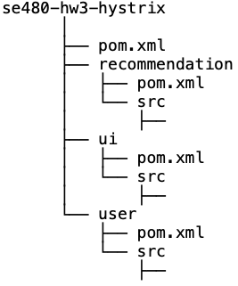

# A Movie Recommendation System

The system is a movie recommendation system consisting of a user interface web application, UI, and two microservices: user, recommendation.
The entire project is a multi-module Spring Boot Maven application with ```UI, user, recommendation``` as separate child modules (see figure 1).

 

*Figure 1. Project structure – a multi-module maven project.*

## UI Web Application
- The user interface service is a Spring Boot application with *Thymeleaf* as the HTML template engine.
- The UI web application runs on port ```8080```.
- The port maybe configured in the ```application.yml``` configuration file.
- The user enters ```username``` and ```password``` and clicks the ```Get Movies``` button to get a list of recommended movies.
- To keep it simple for this homework, the authentication is not persisted in local storage, and the user must supply username and password on every request.

## User Service

- The user service is a **Spring Boot** microservice that maintains a database of user information in an in-memory **MongoDB** implementation (*flapdoodle*) that is loaded at startup.
- The user microservice implements a pseudo-authentication system that mimics **JWT** based authentication.
- Every time a user authentication is requested, the user service generates a Base-64 encoded authentication token based on the user details (*id, username, age*). 
- The token is stored in a map with the authentication token as the key and the user id as the value.
- Subsequent requests for the same user will reuse the token stored in the map. 
- Tokens do not expire but are different across service restarts since the user id is a **UUID** string.
- The user service runs on port ```8081```, which may be configured in the ```application.yml``` configuration file.

###### Relevant Endpoints

```GET: /v1/auth```

## Recommendation Service

- The recommendation service is a **Spring Boot** microservice that recommends movies to authenticated users based on age group.
- It maintains a list of movies in an **in-memory MongoDB** implementation (*flapdoodle*) that is loaded at start up.
- The ```recommendation``` service uses the authentication token to get user details from the ```user``` microservice. It then does the recommendation based on the age group of the user.

###### Endpoints

```GET: /v1/recommend```

The sequence diagram in figure 2 depicts the interactions between the user, the UI, and the two microservices.


*Figure 2. The movie recommendation system sequence diagram.*

- The recommendation microservice has a **Netflix Hystrix** circuit breaker enabled.
- The circuit opens when the user service is *unavailable* or is *delayed by more than 100ms*.
- When the circuit breaker breaks the circuit, the recommendation system recommends movies that are rated for ages below 13.

## Running Unit Tests

From the project root directory:

```$ mvn test```

## Building/Packaging

From the project root directory:

```$ mvn clean package```

- An executable jar file is generated for each module (i.e. 3 in total).
- The jar files are in the ```target/``` directory of each module.

## Running the UI

- Make sure ports ```8080, 8081, 8082``` are free.
- Or configure the ports in the ```application.yml``` configuration files of the respective modules.

To run the UI web application, from the project root directory and on a separate terminal window:

```$ java -jar ui/target/ui-0.0.1-SNAPSHOT.jar```

OR

```$ mvn spring-boot:run -pl ui```

To run the user service, from the project root directory and on a separate terminal window:

```$ java -jar user/target/user-0.0.1-SNAPSHOT.jar```

OR

```$ mvn spring-boot:run -pl user```

To run the recommendation service, from the project root directory and on a separate terminal window:

```$ java -jar recommendation/target/recommendation-0.0.1-SNAPSHOT.jar```

OR

```$ mvn spring-boot:run -pl recommendation```

## Testing the Movie Recommendation Application

- Open a web browser (Chrome or Firefox, preferably).
- Browse to *http://localhost:8080*.
